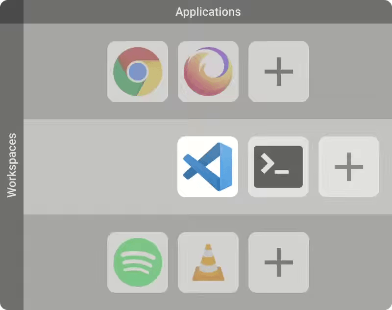

---
<p align="center">
        A <b>modern desktop interface</b> for <b>Linux</b> extending <b><a href="https://wiki.gnome.org/Projects/GnomeShell">GNOME Shell</a></b>.
</p>
<p align="center">
Providing a <b>unique</b>, <b>simple</b>, <b>productivity-oriented</b>, <b>innovative</b> and <b>automated</b> <b>mouse and keyboard <a href="#workflow">workflow</a></b> which aims to be <b>faster</b> and <b>easier</b> to use and creates a <b>great user experience</b>.
</p>
<p align="center">
        Powered by its unique <b><a href="#spatial-model">spatial model</a></b>, its modern <b><a href="#interface">material design interface</a></b>, its <b><a href="#tiling-engine">tiling engine</a></b> and its <b><a href="#persistence">persistability</a></b>.
</p>

<h4 align="center" valign="middle">
Get notified about updates and join us at ‎‎<a href="https://discord.gg/vBb7D9a">
        
</a>
</h4>
<p align="center">
  <a href="#workflow">Workflow</a> •
  <a href="#hotkeys">Hotkeys</a> •
  <a href="#installation">Installation</a> •
  <a href="#uninstallation-">Uninstallation</a> •
  <a href="#history">History</a>
</p>

---


---

# Workflow

Created to **simplify** navigation and **reduce** the need to **manipulate** windows in order to **improve productivity**. It's meant to be 100% **predictable** and bring the benefits of tools coveted by professionals to everyone.

## Spatial Model

This is the **core** of the **workflow** and what everything is built around and in our case it's one of the simplest: **a Grid**

<p align="center" valign="middle">
 
</p>

A **Workspace** is an applications container that can be **visualized as a row** and **applications as cells**.

Every **new application** is **automatically positioned** inside this grid at the end of its workspace row and every **new workspaces** are **appended at the bottom** which is very **predictable** and **always sorted automatically**.

This allows us to provide **intuitive navigation** by moving the screen around a larger context. Navigating **up** and **down** will change the current workspace and navigating **left** and **right** changes the current window(s) on screen.

You can organize your applications by use cases as **activities** or by applications type as **categories**.

## Interface

Designed to represent the **state** of the **workflow** and provide **navigation** capabilities for both a **mouse** and a **touchscreen**.

### Layout

The interface is divided in **two parts**:

In the **left panel** everything pertains to the **system**: workspaces state, current system status, notifications, etc.

On the **right** of the left panel everything pertains to the **active workspace**: the windows on the workspace's row, the layout switcher, and the windows themselves.

<p align="center" valign="middle">
 
</p>

The two most important components are the **system panel** (on the left) and the **workspace panel** (on the top).

#### System panel
The system panel is the main component of the left side of the interface. It consists of:
* **Workspace list and switcher**: This component lists all the workspaces available and the currently selected one. It allows us to navigate to a specific workspace by clicking on its icon.
* **System tray**: This component lists all the information about the system, e.g. network status, bluetooth connectivity, volume, battery, and notification icons.

#### Workspace panel
The workspace panel is the main component of the right side of the interface. It consists of:
* **App switcher**: This component lists all the application windows opened in the current workspace's row and the currently focused one. It allows us to navigate to a specific window within the row by selecting its item.
* **Layout switcher**: This component displays the current layout of the workspace and can be clicked to switch to the next available layout.

### Design
Made by following the **[Material Design guidelines](https://material.io)** - a solid baseline that allows us to provide an **aesthetically pleasing** and **highly accessible** interface.

### Themes
You can choose between 3 different themes:
* Dark
* Light
* Primary (Colorful one)

And there is also a **blurry** version available for the more fancy ones !

## Tiling engine
It's the **tool** that **automatically organize** the application's **window** for you in a **predictable** and mutually **non-overlapping** disposition.

<p align="center" valign="middle">
 
</p>

**Choose** at **any time** which tiling layout suit the most for your need:
* **Maximize**: Single window at a time
* **Split**: 2 windows side by side
* **Simple**: All windows evenly split and stacked along horizontal or vertical axis (useful for ultra wide monitor)
* **Half**: One master window on the left then others windows stacked to the right
* **Grid**: All windows displayed as a grid

## Persistence
The **best way** to **configure** the desktop layout is to **not** have to **do it**.

Material Shell **keeps track** of every **decision** relative to the desktop layout: where are windows, in which workspaces, and in which order.

This allows **configuration** of the layouts **on the go** while using it.

When opening a **new session** Material Shell will **restore every window** previously present with a "**window placeholder** which allows you to reopen any of the previous windows easily at the same spot you like to have them.

## Hotkeys
Some hotkeys might already be used by GNOME Shell - please check your keybindings first.
#### Desktop navigation
* `Super+W` Navigate to the upper workspace/category.
* `Super+S` Navigate to the lower workspace/category.
* `Super+A` Focus the window at the left of the current window.
* `Super+D` Focus the window at the right of the current window.
* `Super+1`, `Super+2` ... `Super+0` Navigate to specific workspace

#### Window manipulation
* `Super+Q` Kill the current window focused.
* `Super+[MouseDrag]` Move window around.
* `Super+Shift+A` Move the current window to the left.
* `Super+Shift+D` Move the current window to the right.
* `Super+Shift+W` Move the current window to the upper workspace.
* `Super+Shift+S` Move the current window to the lower workspace.

#### Extra Hotkeys
* `Super+Space` Cycle the tiling layout of the current workspace.
* `Super+Escape` Toggle the UI of Material-shell, like a Zen mode.

# Installation

#### Get it in two clicks
* Navigate to [extensions.gnome.org](https://extensions.gnome.org/extension/3357/material-shell/)
* Switch the toggle ON

#### Get the most up to date version with Git

1. Check your GNOME Shell version as we only support **gnome-shell >= 3.34.0**

2. Download the extension. Depending on your distribution, there are several ways to acquire it:

| Distribution | Install via | Command |
| :----------- | :---------- | :------ |
| Manjaro      | PACMAN      | `pacman -S gnome-shell-extension-material-shell` |
| Arch Linux   | AUR         | From latest master: `yay -S gnome-shell-extension-material-shell-git` |
| Arch Linux   | AUR         | From latest release: `yay -S gnome-shell-extension-material-shell` |
| Fedora       | DNF         | `sudo dnf install gnome-shell-extension-material-shell` |
| NixOS        | nix         | `nix-env -i gnome-shell-extension-material-shell` |
| Others       | source      | `git clone https://github.com/material-shell/material-shell.git && cd material-shell && make install` |

(We appreciate package maintainers! If you would like to make a package available for your distro please submit a PR so it can be added here!)

3. Reload GNOME Shell:
  + On X.org: Hit `Alt+F2` and type the command `r`
  + On Wayland: Log out and back in

4. Open `gnome-tweaks` and activate the `Material Shell` extension **OR** enable it using
```bash
gnome-extensions enable material-shell@papyelgringo
```


## Recommended Additional Configuration
* GTK and GNOME Shell theme: [Plata Theme](https://gitlab.com/tista500/plata-theme)
* Icon theme: [Tela Icon Theme](https://github.com/vinceliuice/Tela-icon-theme)

# Reset Material Shell

### Reset the Material Shell persistent state
If you have some weird behavior or a degradation over time, it can be a good idea to try to reset the Material Shell state.

1. Open Looking Glass tool by pressing `Alt + F2` and type `lg`
2. Copy and paste the command `global.set_persistent_state('material-shell-state',new GLib.Variant('s', '{}'));`
3. Reload the shell

### Reset the Material Shell settings
If you want to discard all the changes of Material Shell settings and reset to default (Including keybindings)
1. Open a terminal and copy/paste `dconf reset -f /org/gnome/shell/extensions/materialshell/`


# Uninstallation 😢
We're sad to see you go. Before you uninstall, leave us some feedback by [opening an issue](https://github.com/material-shell/material-shell/issues/new/choose) - it will be very helpful in improving Material Shell.

1. Open `gnome-tweaks` and disable the `Material Shell` extension **OR** disable it using
```bash
gnome-extensions disable material-shell@papyelgringo
```
2. Delete the extension directory.
```bash
rm -rf ~/.local/share/gnome-shell/extensions/material-shell@papyelgringo
```
# History
The project is based on my earlier work on [Material Awesome](https://github.com/PapyElGringo/material-awesome).

