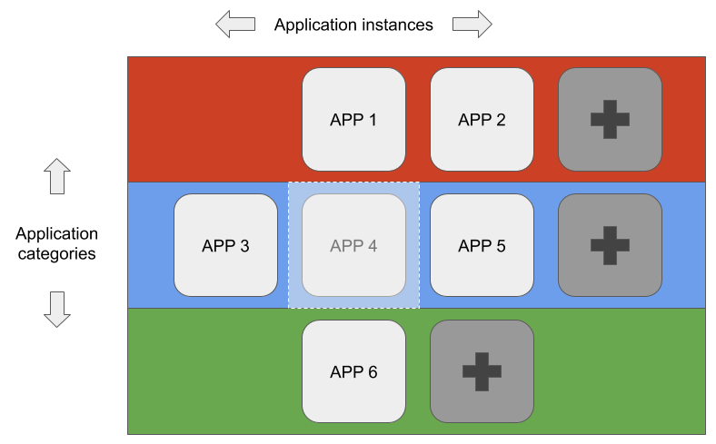
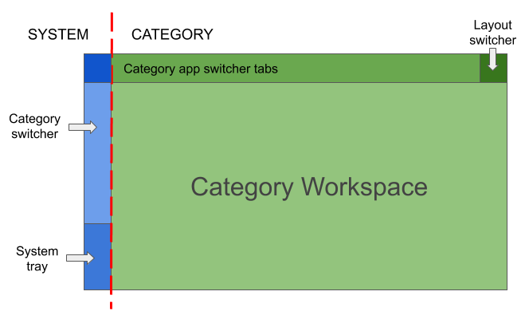

# Material Shell

A simple, productivity oriented GNOME Shell replacement that provides an innovative and automated mouse and keyboard workflow which aims to be faster and easier to use and creates a great user experience.

Made by following the [Material Design guidelines](https://material.io) - a solid baseline that allows us to provide an aesthetically pleasing and accessible interface.

## Workflow

The workflow is the core of the shell and what everything is built around. It's designed to **simplify** navigation and **reduce** the need to **manipulate** windows in order to **improve productivity**.

The concept of application **categories** is an important part of our workflow - they allow us to regroup apps by use-case and group apps which are meant to be used together.

So that we don't have to **manually reorganize** of windows every time we start a new app or change activities, Material Shell handles this process by **automatically resizing and positioning** windows in a predictable way.

This can be visualized as a grid:

Each **colored row** represents a **category**, every **cell** represents an **application window**, and the white area in the center represents the visible area of the screen.

Every **new application** is **automatically positioned** inside this grid at the end of its category's row.

This allow us to provide **intuitive navigation** by moving the screen around a larger context. Navigating **up** and **down** will change the current category and navigating **left** and **right** change the current window(s) on screen.

## Interface

The interface is designed to represent the **state** of the **workflow** and provide **navigation** capabilities for both a **mouse** and a **touchscreen**.

The interface is divided in **two parts**:

On the **left** side everything pertains to the **system**: current status, notifications, etc.

On the **right** everything pertains to the **active category**: the windows on the category's grid, the layout switcher, and the windows themselves.

The two most important components are the **system panel** (on the left) and the **category panel** (on the top).

#### System panel
The system panel is the main component of the left side of the interface. It consists of:
* **Category switcher**: This component lists all the categories available and the currently selected category. It allows us to navigate to a specific category by clicking on its icon.
* **System tray**: This component lists all the information about the system, e.g. network status, bluetooth connectivity, volume, battery, and notification icons.

#### Category panel
The category panel is the main component of the right side of the interface. It consists of:
* **App switcher**: This component lists all the application windows opened in the current category's grid and the currently focused one. It allows us to navigate to a specific window within the grid by selecting its item.
* **Layout switcher**: This component displays the current layout of the category and can be clicked to switch to the next available layout.
